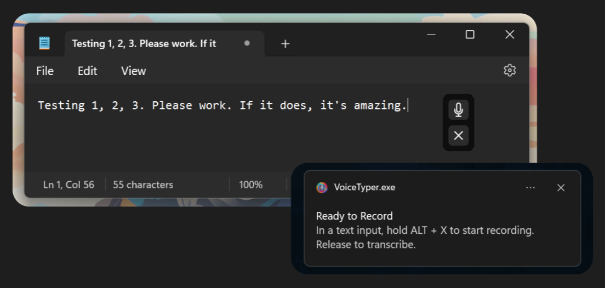

# Voice Typer

A locally run Speech-To-Text voice typer enabled with hotkeys and floating interface for effortless voice typing, powered by the publicly available OpenAI Whisper model.

## Why?

I created this because I couldn't find a free solution that uses a locally run Whisper model (or any speech-to-text model) with a hotkey for easy interaction. Even if a solution exists, this was a cool project to work on. A hotkey, like holding Alt+X, is a super efficient way to control a speech-to-text model—look at your keys! It can type on any input, so as long as your cursor can access it, you can use VoiceTyper on it. With all the typing we do for LLMs, sometimes we want to explain things in detail, but typing it all out can feel long and tedious. Using voice is faster and more interactive. Now, the next few projects will be built even faster. Let's gooo!

## Features

- Floating, draggable, minimal mic/close app interface
- Speech-to-text transcription using OpenAI's Whisper model
- Automatic output of transcribed text to the active window
- Global hotkey hold (Alt+X) to start/stop recording
- Press the "X" button on the floating window to quit

## Requirements

- Windows 10 or later
- At least 10GB of VRAM (for GPU acceleration)
- Microphone

## Installation for Users (TBD)

1. Download the latest VoiceTyper.exe from the releases page
2. Run the VoiceTyper.exe file
3. Allow any necessary permissions when prompted
4. Hold Alt+X to start/stop recording or interact with the floating microphone interface

## For Developers

### Setup

1. Clone this repository
2. Create a virtual environment: `python -m venv env`
3. Activate the virtual environment:
   - Windows: `.\env\Scripts\activate`
   - Unix/MacOS: `source env/bin/activate`
4. Install dependencies: `pip install -r requirements.txt`

### Running the Application

- Use `.\run.ps1` to run the application in development mode

### Building the Executable

1. Ensure you have PyInstaller installed: `pip install pyinstaller`
2. Run the build script: `.\build.ps1`
3. The executable will be created in the `dist` folder

### Project Structure

- `main.py`: Entry point of the application
- `ui.py`: User interface implementation
- `recorder.py`: Audio recording functionality
- `transcriber.py`: Speech-to-text transcription using Whisper
- `typer.py`: Handles text output to the active window
- `utils.py`: Utility functions

## Issues

* The hot keys (ALT+X)), which is the ideal way to use it works. However, clicking on the record button removes focus from the input the cursor was at. This causes the program to enter characters into the unknown. For now, it's just used as a recording indicator.

## Disclaimer

* I'm not responsible for any errors or inaccuracies generated by the typing tool, or for any temporary or permanent damage that may happen to your computer as a result of using it. :)
